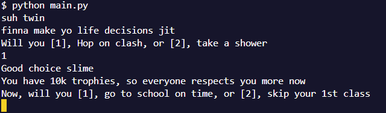

# Life Decision Simulator  

Welcome to **Life Decision**, a lighthearted text-based adventure game where you make choices that define your vibe. Will you hop on Clash? Take a shower? Skip class for Wendy’s? Or maybe… discover the meaning of life scrolling reels all day?  

Your journey is in your hands.  

---

## How It Works  

- You’ll be presented with different **life choices**.  
- Input `1` or `2` (depending on the options shown).  
- The game reacts with humor, roasting you or rewarding you, depending on your choice.  

---

## Getting Started  

1. Clone or download this repo.  
2. Run the Python file:  

```bash
python main.py
```
 
## Gameplay
